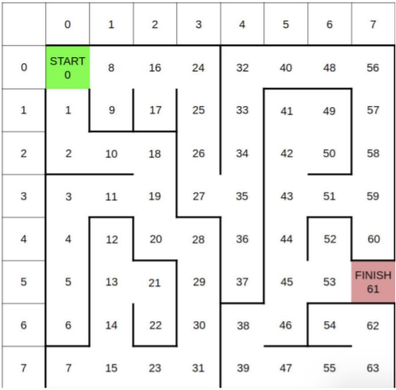

# AI_Search_Algorithms
This repository includes the implementations of 4 classic AI search algorithms:
- Uniform-cost search (UCS)
- Iterative deepening search that uses depth-first tree search as core component and avoids
loops by checking a new node against the current path
- Graph-search Greedy best-first search using the Manhattan distance as heuristic
- Graph-search A* using the same heuristic as above

## Input format for graph
The graph in this problem presents a maze of size NxN:

And it is input in the following format:
- The first line containes N
- The next NxN lines, each contains an adjacency list of node i
- The last line contains the exiting node

The example input for the maze given above is provided in input.txt file.

*Note: since the graph presents a maze, the weight of each edge equals 1. 

## Output format
The output for each algorithm is: 
- The first line is the number of explored nodes (not including the goal node).
- The second line is the list of explored nodes in order.
- The last line is the list of nodes showing the path from starting node to the goal node.

## Others:
- There is a `Node` class for saving the priority of each node and its id. This class helps priority queue in UCS, A*, GBFS functions know which node to get (explore) next. When some nodes have the same priority we choose the node that comes first in lexicographically order (e.g node 12 will be chosen over 7 as "12" < "7" lexicographically). 
- The heuristic function used in GBFS and A* algorithms is Manhattan distance.
